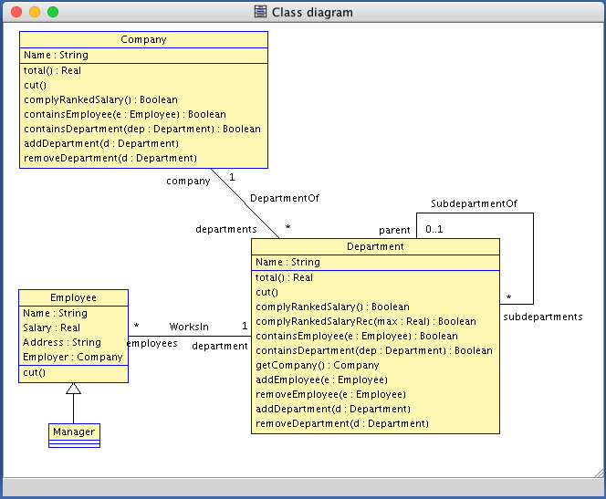
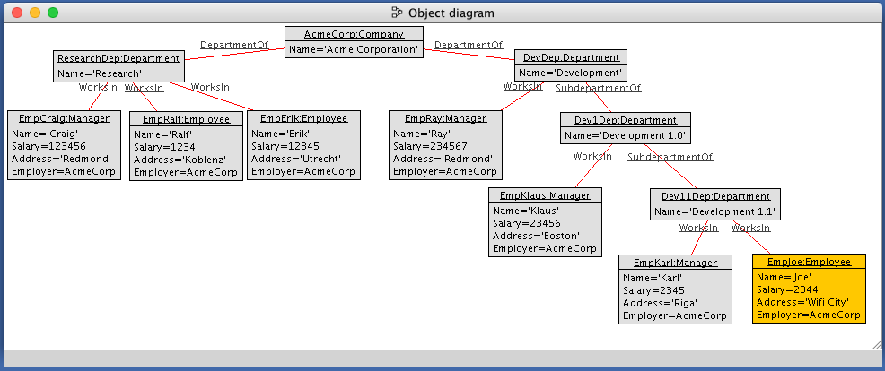

OCL For 101Companies
===================

This Repo contains the 101Companies 'implementation' using OCL.

This implementation uses [USE OCL](http://useocl.sourceforge.net/w/index.php) to allow OCL 'execution'.

Usage
=====
In order to use the given implementation you need to download [USE OCL](http://useocl.sourceforge.net/w/index.php/Main_Page#Download).

After running the program, you get a terminal window and the USE window.

Type the following commands into the terminal window.
```
open /path/to/101companies.use
open testdata
```
These commands open the specification and loads a sample company into memory.

The class and object diagrams can be rearanged and should look like the following images:




### Checking Class Invariants
The ⚡ button checks all invariants and shows the output. You can doubleclick every constraint and see the stacktrace of the execution.

### Pre- And Postconditions
The `testdata` file also does all pre and postcondition checks for all operations executed.
If you take a look at the output in the terminal window, you should find something like
```
testdata> !openter AcmeCorp addDepartment(ResearchDep)
precondition `department_not_in_company' is true
precondition `department_has_no_company' is true
testdata> !insert (ResearchDep, AcmeCorp) into DepartmentOf
testdata> !opexit
postcondition `department_has_company' is true
postcondition `department_was_added' is true
```

Here we enter the operation `addDerpartment` for our company. Then we execute the commands needed to execute the operation and exit the operation.
USE checks each precondition when entering the operation and checks every postcondition when exiting. Here everything worked just fine and the department was added to the company.

You can type these commands into the terminal window yourself. Try running
```
use> !openter EmpKarl cut()
<<precondition check>>
use> !set EmpKarl.Salary := 1172.5
use> !opexit
<<postcondition check>>
```
This should execute sucessfully. But since Karl is the manager of the _Development 1.1_ department, the company does not comply to the ranked salary. Pressing the ⚡ button again shows us the error.
